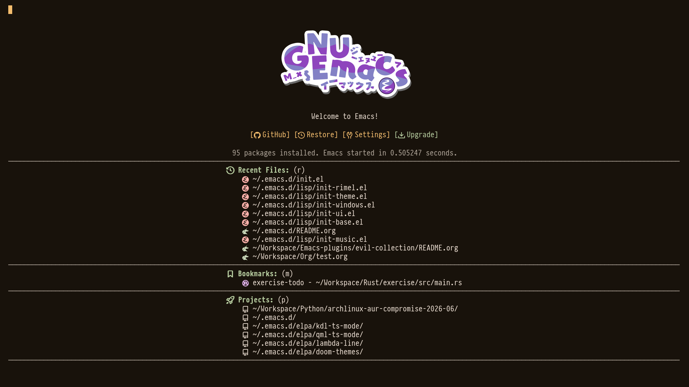
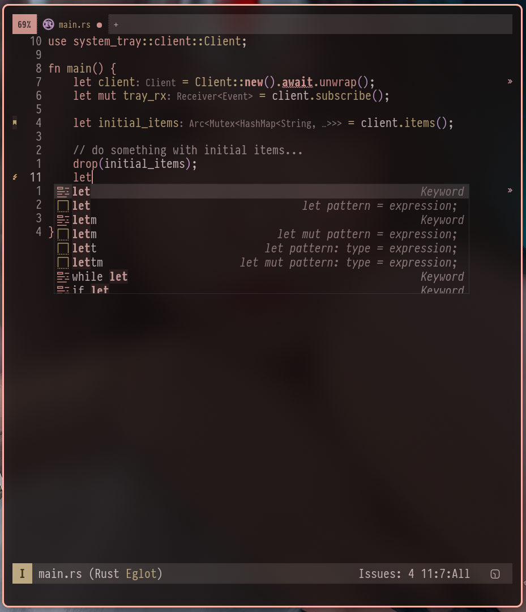
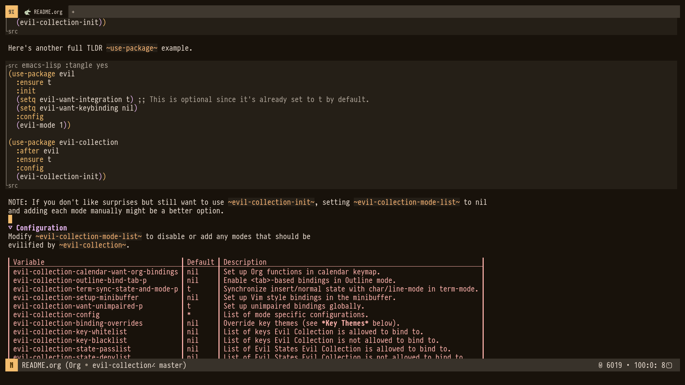

#+TITLE: .emacs.d
#+AUTHOR: aiser
#+EMAIL: wtchel088@gmail.com
#+LANGUAGE: zh-CN
#+OPTIONS: ^:{} toc:nil num:nil

基于 [[https://codeberg.org/ashton314/emacs-bedrock][emacs-bedrock]] 构建的 Emacs 配置，面向 Emacs 31 (git master)，集成 evil 键绑定。

English version: [[file:assets/README-en.org][README-en.org]]

* 特性

- Evil 模式键绑定，Vim 用户体验
- Corfu + Vertico + Embark 现代补全体系
- Eglot (LSP) + Dape 调试，代码开发一站式支持
- Tree-sitter 主流语言支持（Go / Rust / Python / JS 等）
- Org-mode 深度配置 + Elfeed RSS + mu4e 邮件
- Dashboard 启动页 + Tabspaces 工作区管理
- Magit Git 集成 + diff-hl 高亮
- EMMS 音乐播放、Telega Telegram 客户端
- Apheleia 自动格式化，no-littering 保持目录整洁
- 包源默认使用中科大镜像，国内安装速度快

* 要求

- Emacs 31 或更高版本（git master）
- 推荐 [[https://www.nerdfonts.com/][Nerd Font]]（图标显示）
- 可选：mpd（EMMS 音乐播放）、mu（邮件）

* 快速开始

** 安装

#+begin_src bash
git clone https://github.com/acdcbyl/.emacs.d.git ~/.emacs.d/
#+end_src

首次启动时会自动安装依赖包。建议使用 Emacs 31 git master 版本以获得最佳体验。

* 目录结构

| 文件                   | 说明                                    |
|------------------------+-----------------------------------------|
| ~early-init.el~        | 早期初始化（GC、native-comp、UI 精简） |
| ~init.el~              | 主入口，按序加载各模块                  |
| ~lisp/init-base.el~ 等 | 基础设置与各功能模块                    |
| ~lisp/lang/~           | 语言相关配置（go/rust/python/js...）   |
| ~lisp/extension/~      | 自行扩展的第三方包（mu4e-nano 等）     |
| ~custom.el~            | =customize 生成的设置（自动生成）      |

主要模块一览：

| 模块                | 功能         |
|---------------------+--------------|
| init-completion.el  | 补全体系     |
| init-dev.el         | LSP 与开发   |
| init-check.el       | 语法检查     |
| init-dap.el         | 调试器       |
| init-diff.el        | Git/Diff     |
| init-project.el     | 项目管理     |
| init-workspaces.el  | 工作区       |
| init-org.el         | Org-mode     |
| init-email.el       | 邮件 (mu4e)  |
| init-feed.el        | RSS (Elfeed) |
| init-emms.el        | 音乐 (EMMS)  |
| init-telega.el      | Telegram     |
| init-dashboard.el   | 启动页       |
| init-ui.el / theme  | 外观主题     |

* 截图

** Dashboard

** LSP

** Org-mode

